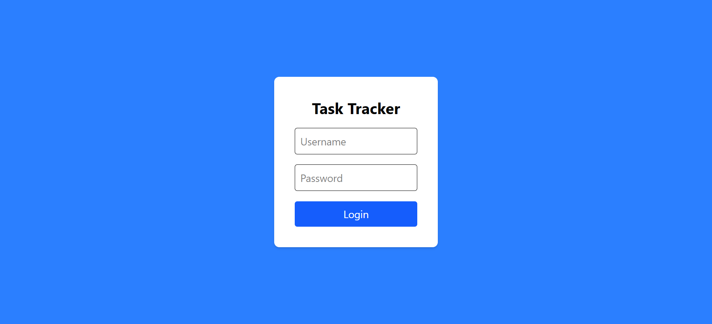
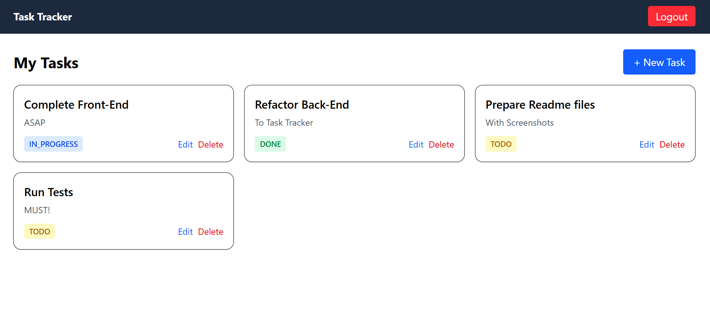
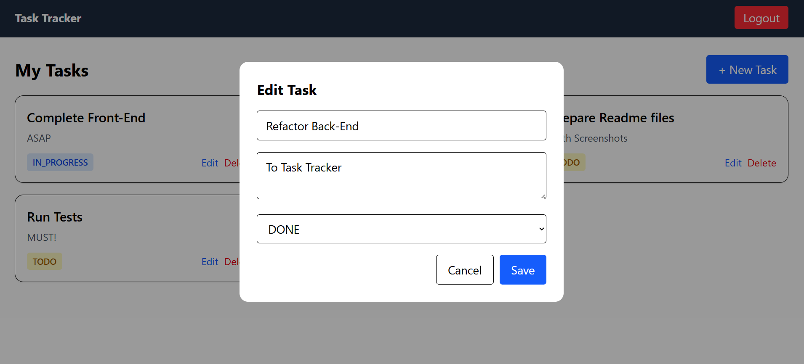
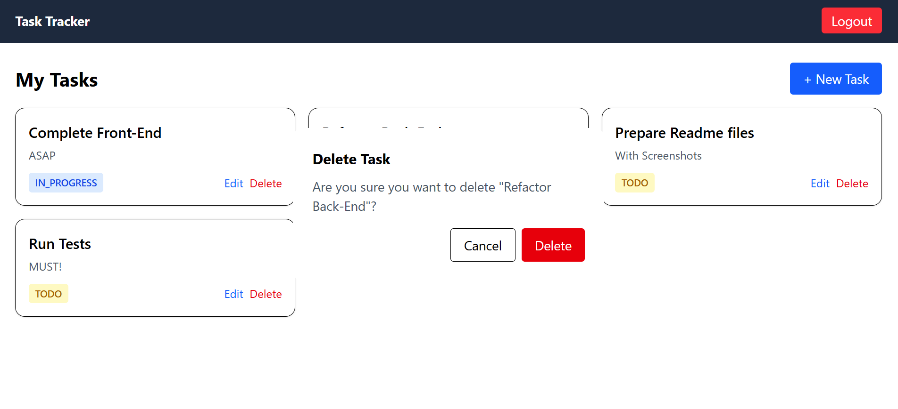

# Task Tracker - FrontEnd

Frontend application for a full-stack Task Tracker system built with **React,TypeScript, and Vite**.

This app communicates with a secured Spring Boot REST API using JWT authentication and provides full CRUD functionality
for managing tasks.

---

## Features

- JWT Authentication with Axios Interceptor
- Secure Login & Logout
- Protected Routes with React Router
- Create, Read, Update, Delete Tasks
- Reusable Modals for Forms and Confirmation
- Responsive UI with Tailwind CSS
- Fast development with Vite
- REST API Integration
- Pagination Handling

---

## Tech Stack

- React 18
- TypeScript
- Vite
- Axios
- React Router
- Tailwind CSS

---

## Project Structure

src/  
├─ api/ # Axios instance and API services  
├─ components/ # Reusable UI components  
├─ pages/ # Application pages  
├─ routes/ # Protected routing logic  
├─ types/ # Shared TypeScript types  

---

## Setup & Installation

### Prerequisites

- Node.js (v18+ recommended)
- Running backend server

---

### Installation

1. Clone the repository  
   **git clone <frontend-repo-url>**
2. Install dependencies  
   **npm install**
3. Start development server  
   **npm run dev**

---

### The application will run on:

http://localhost:5173

---

## Authentication Flow

1. User submits credentials
2. Backend validates and returns JWT
3. Token is stored in localStorage
4. Axios interceptor attaches token to requests
5. Protected routes require authentication

---

## API Integration

All API calls are handled via a centralized Axios instance.

Main endpoints:

**| Method | Endpoint | Description |**   
| POST | /api/auth/authenticate | Login |  
| GET | /api/tasks | Fetch tasks |  
| POST | /api/tasks | Create task |  
| PUT | /api/tasks/{id} | Update task |  
| DELETE | /api/tasks/{id} | Delete task |

---

## State Management

Local React state is used for managing:

* Authentication state
* Tasks list
* Modal visibility
* Edit/Delete actions

Data is synchronized with the backend API.

---

## UI Components

* TaskCard – Displays individual tasks
* TaskFormModal – Create/Edit tasks
* ConfirmModal – Delete confirmation
* Navbar – Navigation and logout

---

## Screenshots

### Login Page

### Dashboard

### Create / Edit Task

### Delete Confirmation

---

## Future Improvements

* Task filtering and search
* Sorting by status/date
* Drag & Drop support
* User profile management

---

## Author

Joanna Kotronaki   
Junior Software Developer

GitHub: https://github.com/Jeanne9999

---

## License

This project is created for educational and portfolio purposes.
